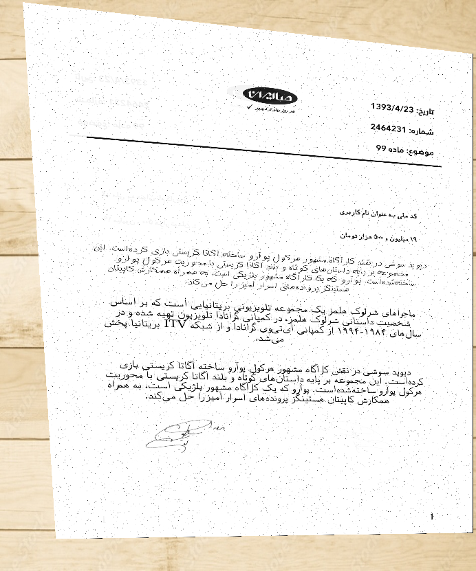

# ocrdocgen (OCR)

# Overview
A simple tool for generating synthetic dataset for training of both **detection** and **recognition** part of an OCR pipeline.

## Sample of synthetic document


## Sample of synthetic document with bounding boxes visualization

## Installation
```bash
python3 -m pip install -r requirements.txt
python3 -m pip install flit && flit install --symlink --python /usr/bin/python3
```
* Install the provided weasyprint port which supports dumping the required bounding boxes 
``` 
cd WeasyPrint && python3 -m pip install . 
```

## How to use:
Just run the `main.py` file. 
```bash
python3 ./main.py
```

"texts/example.txt" is the input text.
"templates/" is the folder to store templates in jinja2.
"images/" is the images folder to use in the template.
"fonts/" is the fonts folder. poupulate some fonts
run "dataset_generator.py".


# Dockerimage

```bash
DOCKER_BUILDKIT=1 docker build . 
```


# Updates
* [2023/08/19] Make the code publicly available.